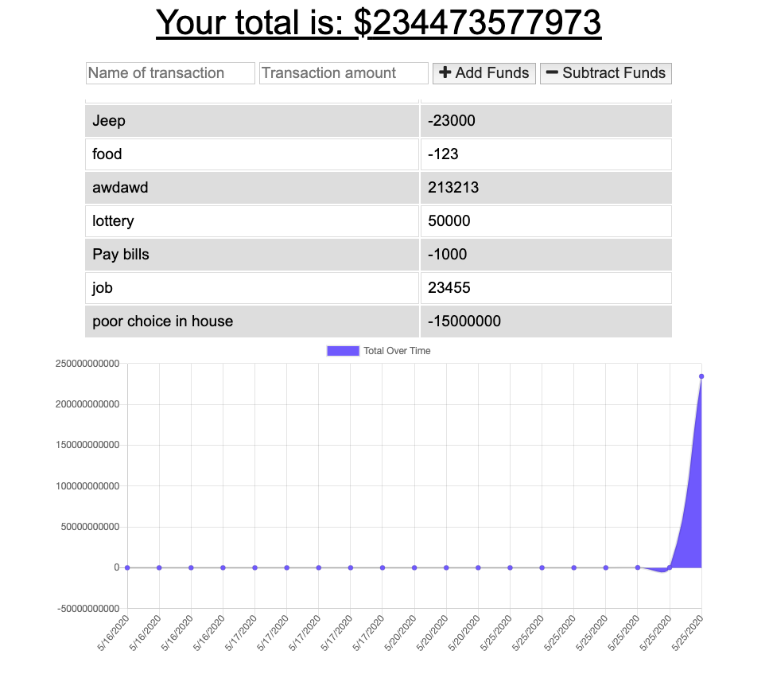

## Table of Contents
##### 1. [Project Description](#Project-Description)
##### 2. [GitHub Address](#GitHub-Address)
##### 3. [License Type](#License-Type)
##### 4. [Dependencies](#Dependencies)
##### 5. [Test Run Commands](#Test-Run-Commands)
##### 6. [Author Contact Information](#Author-Contact-Information)
---
# **Personal Off/Online Finances**

### **Project Description:**
##### This program allows you enter in transactions while you are on and offline. If you are offline, it uses an indexedDb to cache the transactions until you are online. It then pushes the cached transactions up to the online DB.
---
### **GitHub Address:**
[Personal Off/Online Finances](https://github.com/rysiphoto/PWA)
---
### **License Type:**
##### MIT

---
### **Dependencies**
##### npm i
---
### **Test Run Commands**
##### node server
---
### **Image**

##### 
---
### **Author Contact Information:**

* Ryan Siverson
* rcsskier@mac.com
* [GitHub](https://github.com/rysiphoto)
* [LinkedIn](https://www.linkedin.com/in/ryan-siverson-695b5a32/)

---
---
###### © Ryan Siverson 2020
